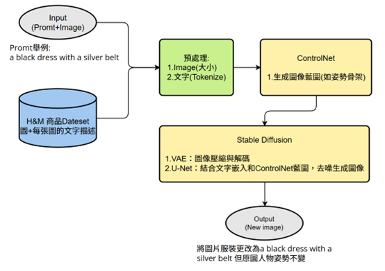

# 陳妙音的作品集 Portfolio

## Work Experiences
暑期研究實習生(中研院GIS中心)   
- 📙以舒適度為考量之行人路徑規劃
   - 透過影像辨識及全景分割技術，獲取具有騎樓之路段資料
   - 使用Python設計路徑最佳化演算法，其考量多項GIS空間數據，如數值高程模型及具騎樓之路段
   - 建立全端網頁，供使用者查詢並呈現路徑結果
   - [簡報]()

## Projects
- 📗畢業專題: Podcast 智慧搜尋系統 (AI-Powered Podcast Content Retrieval System)  
   - 使用LLM、RAG與向量資料庫的Podcast內容搜尋系統，獲選全系第二名
   - 使用兩種方法優化傳統RAG知識檢索
     1. 動態去冗檢索：挑選最具代表性的語意資料，提升系統回覆事實性60%
     2. Prompt Engineering為架構的Self-Reflection迴圈：讓LLM自動評估並修正不好的回覆，降低幻覺
   - [Youtube介紹影片](https://youtu.be/322Nec2wxBw), [簡報](), [成果報告書]()

- 📗Miao-Yin Chen, Shu-Han Chuang. Diffusion-Based Garment Synthesis via Knowledge Graph-Driven Cross-Modal Semantic Alignment  
   - 本研究旨在文字生成使用者指定服裝的全身圖像，並保留輸入照片中的人體姿勢，可用於客製化內容，生成特定風格服飾。
   - 我們以H&M商品照片集與各照片相對應的文字描述進行訓練，使用Stable Diffusion的文本生成圖像技術，並搭配ControlNet製作輸入圖像的藍圖，可生成人物骨架或輪廓，讓Stable Diffusion依此結構畫圖，依照使用者給予的一張人物照及服裝文字描述，生成姿勢一致但造型不同的新圖像。

    
   - [簡報](), [論文](), [研討會發證明]()
   - 
- 📗Shu-Han Chuang, Miao-Yin Chen. A Retrieval-Augmented Generation Chatbot with Fine-Tuned Large Language Models for Context-Aware Mental and Physical Health Solutions  
   - 本研究利用RAG結合LLM並fine-tuned，製作出一款不只是能夠回覆健康知識且具有同理心的LINE bot
   - [簡報](), [論文](), [研討會發證明]()
 
- 📗Sui-Hua Ho*, Yu-Hsuan Liu, **Miao-Yin Chen**. (2024, July 12-14). Bodystorming and co-creation in a mobile app development for children. 2024第十屆臺灣人機互動研討會(TAI CHI 2024), Tainan, Taiwan.  
   - 使用凱比機器人的程式系統與 Power Apps 開發正念應用程式，讓7到11歲的孩童進行正念練習，並比較教育型機器人與一般教育應用程式的效果與差異。  
   - [論文](TAICHI2024Paper.pdf), [海報](TAICHI2024Poster.pdf), [研討會發表證明](TAICHI2024Certificate.pdf)

## 比賽
- 🎯AI CUP 2025春季賽－桌球智慧球拍資料的精準分析競賽
   - 在官方提供的資料集中，從特徵工程及演算法下手，使用xgboost、lightgbm、random forest、catboost預測

## 課堂專案

### 【電腦視覺】
- 🔍**動作偵測與比對**
   - 針對頭部進行頭部的旋轉及傾斜角度的偵測。
   - 針對高爾夫揮棒動作進行偵測與比對，先取得兩部揮棒影片的人體姿勢骨架，並利用DTW(動態時間規整)比對兩部影片動作的差異。
   - [專案報告](課堂專案/動作偵測與比對/動作偵測與比對成果.pdf)

 
- 🔍**YOLO物件辨識-籃球轉播畫面**
   - 利用roboflow物件標註，並使用yolov9訓練，讓模型能辨別籃球、球員、裁判、球框、球隊分數等
   - 利用mAP_0.5、mAP_0.5:0.95及confusion matrix評估模型優劣
   - [專案報告](課堂專案/YOLO物件辨識_籃球轉播畫面/YOLO物件辨識報告.pdf)
 
### 【機器學習模型預測】
- 🔍**動物照片辨識**
   - 使用卷積神經網路(CNN)對8種動物照片進行訓練
   - 完成三種不同的模型，並評估哪一種模型準確率最高
   - [專案報告](課堂專案/動物照片辨識/辨識動物_機器學習成果報告.pdf)
 
- 🔍**動物叫聲辨識**
   - 利用librosa及卷積神經網路（CNN）對聲音資料進行特徵擷取與分類，辨識13種動物聲音，提升聲音事件辨識的準確率。
   - [程式碼](課堂專案/動物叫聲辨識/AnimalSound_DeadSimpleSpeechRecognition.ipynb)
 
- 🔍**辨識歌手歌聲與歌曲節拍分析**
  - 使用 Selenium、Wordcloud 和 Tkinter 開發資料擷取與視覺化工具，透過 Tkinter 建立使用者介面，爬取歌詞生成文字雲，辨識音檔節拍，並運用機器學習訓練模型識別歌手聲音，預測歌曲演唱者。
  - [專案報告](Course_MusicAnalysis.pdf)

 
### 【金融科技】  
- 🔍**利用AI機器學習找尋股票投資組合**
   - 本研究結合金融科技與資料科學，建構AI輔助投資策略的方法，展現以機器學習處理大規模金融數據的必要性與潛力。

### 【遊戲】
- 🔍**成為磚家Pygame**
  - 自學pygame，與三位同儕合力完成打磚塊遊戲，並新增特殊玩法及多重關卡 
  - [YouTube介紹影片](https://youtu.be/U479OtfxdCY)

## 證書
- SSE Python 滿分 [證書](SSEpythonCertificate.pdf)
- 英文 多益805分 [證書](TOEIC.pdf)
